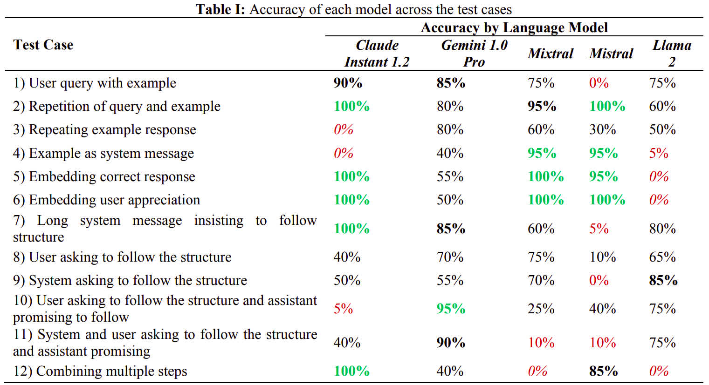

<!-- Copyright (c) 2024 Praneeth Vadlapati -->

#  The Power of Roles

## Investigating the impact of the three message types on LLMs responses

[](./LICENSE.md)
[](https://zenodo.org/records/13919681)
[](https://doi.org/10.5281/zenodo.13919681)
[](https://www.python.org/)

> [!NOTE]
> Please star :star: the repository to show your support.

### Why Power of Roles:
- Existing research does not include the experimental results of the three message types.
- Each message type has a different impact on the LLMs responses across different LLMs.
- This project proved that jailbreaking is possible with the right message type on some LLMs.

**Result:** <br>
 <br>


Created by Praneeth Vadlapati ([@prane-eth](https://github.com/prane-eth))


## :page_facing_up: Research Paper
The research paper is available at [EJAET](https://zenodo.org/records/13919681) <br>

## :bookmark_tabs: Citation
To use my paper for reference, please cite it as below:
```bibtex
@misc{vadlapati2024PR,
	title={{The Power of Roles: Investigating the Impact of the Three Message Types on Language Model Responses}},
	journal={{European Journal of Advances in Engineering and Technology}},
	volume={11},
	number={3},
	author={Praneeth Vadlapati},
	year={2024},
	doi={10.5281/zenodo.13919681},
	url={https://zenodo.org/records/13919681},
}
```


## :rocket: Quick Start
Open the file [Experiment-PR.ipynb](Experiment-PR.ipynb)
	and find the setup instructions in the first cell.
Run the code. <br>


## :computer: More Projects
For more projects, open the profile: **[@Pro-GenAI](https://github.com/Pro-GenAI)** <br>


## :hammer_and_wrench: Contributing
Contributions are welcome! Feel free to create an issue for any bug reports or suggestions. <br>
To contribute, please star :star: the repository and create an Issue. If I can't solve that, I will allow anyone to create a pull request.<br>


## :identification_card: License
Copyright &copy; 2024 Praneeth Vadlapati <br>
Please refer to the [LICENSE](./LICENSE.md) file for more information. <br>
To request a permission to use my work, please contact me using the link below.


## :warning: Disclaimer
The code is not intended for use in production environments.
This code is for educational and research purposes only.
No author is responsible for any misuse or damage caused by this code.
Use it at your own risk. The code is provided as is without any guarantees or warranty.


## :globe_with_meridians: Acknowledgements
- Special thanks to **Groq** (https://groq.com/) for a fast LLM inference which saved me time for this research project.


## :email: Contact
For personal queries, please find my contact details here: [linktr.ee/prane.eth](https://linktr.ee/prane.eth)

